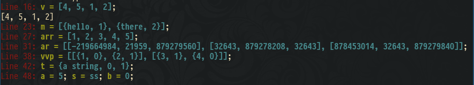

# Competitive Programming

## What is this?
A place to save my codes, specialized for competitive programming.

## How to use debug template?
Debug template for competitive programming `mydebug.h`
Support: 
  - Show variables names (or function, expression...) and their values
  - Print any stl container that has `begin()` and `end()`
  - Support line number
  - Pretty print with ascii-color on linux, (for window [enable virtual terminal processing](https://superuser.com/a/1300251))

Usage:
  - Replace `#include <mydebug.h>` with its content
  - Or copy file `mydebug.h` to `/usr/include/`
  - Remember to compile with option `-DLOCAL`
  - Works out of the box for `c++17`, if you use `c++14` you had to replace/remove `operator<<` for `tuple`
Code:

``` cpp
#include <bits/stdc++.h>

// add these line
// or copy mydebug.h content here
#ifdef LOCAL
#include <mydebug.h>
#else
#define debug(...)
#endif

using namespace std;

int main() {
  vector<int> v = {4, 5, 1, 2};
  debug(v); // use cerr

  // use normal cout
  cout << v << endl;

  // work for vector, map, set, array, deque... (has begin(), and end())
  map<string, int> m = {{"hello", 1}, {"there", 2}};
  debug(m);

  // even c-array
  int arr[5] = {1,2,3,4,5};
  debug(arr);

  // multi dimension array
  int ar[3][3];
  debug(ar);

  // multi demension vector
  vector<vector<pair<int,bool>>> vvp = {
    {{1, false}, {2, true}},
    {{3, true}, {4, false}}
  };

  // tuple
  tuple<string,int,float> t{"a string", 0, 1.f};
  debug(t);

  // multiple variable in one line
  int a = 5;
  string s = "ss";
  bool b = false;
  debug(a, s, b);
}
```

Comiple with: `g++ -std=c++17 template.cpp -o template -DLOCAL`

Result


## Want to compile faster?
Reduce g++ compile time to `1/3` when `#include <bits/stdc++>` using `precompile header`

`tobe continued...`
